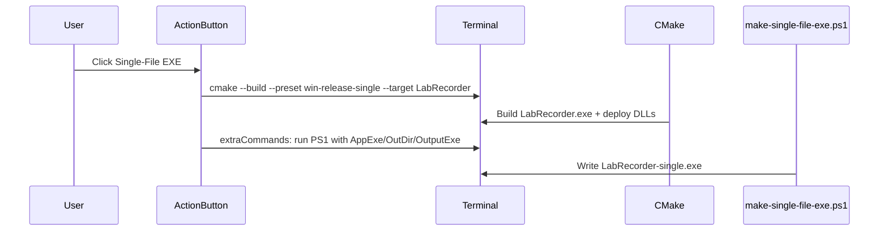

# Add Single-File EXE Action Button

## Context

[`App-LabRecorder.code-workspace`](c:\Users\pho\repos\EmotivEpoc\ACTIVE_DEV\App-LabRecorder\App-LabRecorder.code-workspace) already has an empty `actionButtons.commands` array. The [VSCode Action Buttons Ext](https://github.com/jkearins/vscode-action-buttons) extension runs terminal commands when `useVsCodeApi` is `false`, supports `${workspaceFolder}` substitution, and can chain follow-up commands via `extraCommands`.

[`scripts/windows/make-single-file-exe.ps1`](c:\Users\pho\repos\EmotivEpoc\ACTIVE_DEV\App-LabRecorder\scripts\windows\make-single-file-exe.ps1) requires three mandatory args (`-AppExe`, `-OutDir`, `-OutputExe`) and optional `-SevenZipDir`. CMake invokes it the same way in [`CMakeLists.txt`](c:\Users\pho\repos\EmotivEpoc\ACTIVE_DEV\App-LabRecorder\CMakeLists.txt):

```powershell
-AppExe "$<TARGET_FILE:LabRecorder>"
-OutDir "$<TARGET_FILE_DIR:LabRecorder>"
-OutputExe "$<TARGET_FILE_DIR:LabRecorder>/LabRecorder-single.exe"
-SevenZipDir "${SEVENZIP_DIR}"
```

For the `win-vs-release-single` preset ([`CMakePresets.json`](c:\Users\pho\repos\EmotivEpoc\ACTIVE_DEV\App-LabRecorder\CMakePresets.json)), the Release output directory is:

`${workspaceFolder}/out/build/win-vs-release-single/Release/`

Seven-Zip path from the preset cache: `C:/Users/pho/scoop/apps/7zip/current`

## Change

Edit the `actionButtons` block in [`App-LabRecorder.code-workspace`](c:\Users\pho\repos\EmotivEpoc\ACTIVE_DEV\App-LabRecorder\App-LabRecorder.code-workspace) (lines 44–50):

1. **Add `customVars`** for the 7-Zip install path (keeps the long path out of the command string):

```json
"customVars": {
    "sevenZipDir": "C:/Users/pho/scoop/apps/7zip/current"
}
```

2. **Add one command entry** to `commands`, modeled on your user-profile reference (terminal command, orange color, tooltip):

```json
{
    "name": "Single-File EXE",
    "color": "#ed9600",
    "tooltip": "Build Release and package LabRecorder-single.exe",
    "useVsCodeApi": false,
    "terminalName": "LabRecorder Build",
    "cwd": "${workspaceFolder}",
    "command": "cmake --build --preset win-release-single --target LabRecorder",
    "extraCommands": [
        "powershell -NoProfile -ExecutionPolicy Bypass -File \"${workspaceFolder}/scripts/windows/make-single-file-exe.ps1\" -AppExe \"${workspaceFolder}/out/build/win-vs-release-single/Release/LabRecorder.exe\" -OutDir \"${workspaceFolder}/out/build/win-vs-release-single/Release\" -OutputExe \"${workspaceFolder}/out/build/win-vs-release-single/Release/LabRecorder-single.exe\" -SevenZipDir \"${sevenZipDir}\""
    ]
}
```

3. **Leave existing defaults unchanged**: `defaultColor`, `reloadButton`, `loadNpmCommands`.

## Flow



## Prerequisites / notes

- **One-time configure**: The preset must already be configured (`cmake --preset win-vs-release-single`). If not, the build step will fail; this matches the documented workflow in [`BUILD.md`](c:\Users\pho\repos\EmotivEpoc\ACTIVE_DEV\App-LabRecorder\BUILD.md).
- **7-Zip**: Must be installed at the path in `customVars` (or on PATH; the script also searches common install locations if `-SevenZipDir` is omitted).
- **Reload**: After saving the workspace file, click the reload button or run **Refresh Action Buttons** to show the new status-bar button.
- **Multi-root workspace**: `${workspaceFolder}` resolves to the first folder (`.`), which is App-LabRecorder — correct for these paths.

## Verification

After applying the change:

1. Reload the workspace / refresh action buttons.
2. Confirm **Single-File EXE** appears in the status bar.
3. Click it and verify the terminal runs CMake build, then the PowerShell script.
4. Confirm output: `out/build/win-vs-release-single/Release/LabRecorder-single.exe`
