# Stabilize Stream Recording in App-LabRecorder

## Root cause analysis

The visible "duplicate red entries on Load" is a symptom of two coupled state bugs in [src/mainwindow.cpp](src/mainwindow.cpp). The far worse consequence is silent **double-recording of every stream** into the XDF file when a user loads a config and starts a recording.

### Bug A — `load_config` does not reset `knownStreams`

```163:177:src/mainwindow.cpp
void MainWindow::load_config(QString filename) {
    ...
    auto required = pt.value("RequiredStreams").toStringList();
    missingStreams = QSet<QString>(required.begin(), required.end());
```

`missingStreams` is rebuilt from the cfg, but `knownStreams` (the cumulative list of resolved LSL streams) is left untouched. After load, every stream the user previously had online still lives in `knownStreams`.

### Bug B — `refreshStreams` only reconciles `missingStreams` for *newly added* streams

```339:351:src/mainwindow.cpp
for (const auto& s : resolvedStreams) {
    bool known = false;
    for (auto &k : knownStreams) {
        known |= s.name() == k.name && s.type() == k.type && s.source_id() == k.id;
    }
    if (!known) {
        bool found = missingStreams.contains(info_to_listName(s));
        knownStreams << StreamItem(..., found);
        if (found) { missingStreams.remove(info_to_listName(s)); }
    }
}
```

The `missingStreams.remove(...)` is inside the `if (!known)` branch. So if the stream is already in `knownStreams` (the post-load state), the cfg's `"Stream (Host)"` entry is NEVER cleaned out of `missingStreams`. The list-build at the bottom then renders that name as **red (missing)** AND the same stream as **green (known)** → the screenshot you're seeing.

### Bug C (the dangerous one) — duplicate inlets / duplicate XDF streams

In [src/mainwindow.cpp](src/mainwindow.cpp) `startRecording`:

```476:500:src/mainwindow.cpp
std::vector<std::string> watchfor;
for (const QString &missing : std::as_const(missingStreams)) {
    ...
    watchfor.push_back(query);
}
...
currentRecording = std::make_unique<recording>(recFilename.toStdString(),
    requestedAndAvailableStreams, watchfor, syncOptionsByStreamName, true);
```

When Bug A+B occur, every stream the user wants is in **both** `requestedAndAvailableStreams` (checked + resolved) **and** `watchfor` (still in `missingStreams`). The `recording` ctor then spawns:

- a phase-locked `record_from_streaminfo` thread for each item in `streams`, and
- a `record_from_query_results` watcher for each `watchfor` query.

```91:97:src/recording.cpp
for (const auto &stream : streams)
    stream_threads_.emplace_back(new std::thread(&recording::record_from_streaminfo, this, stream, true));
for (const auto &query : watchfor)
    stream_threads_.emplace_back(new std::thread(&recording::record_from_query_results, this, query));
```

The watcher's `known_source_ids` set is **local to that thread** — it does not know about the streams already being recorded phase-locked. So it resolves the same stream and spawns a *second* `record_from_streaminfo` for it (non-phase-locked, fresh `streamid_`).

The XDF file ends up with **two separate stream headers + two parallel sample streams for every device** every time you Load a config and Start. This is silent data corruption.

## Data flow today vs. after fix

```mermaid
flowchart TD
  subgraph today [Today: Load -> Start]
    L1[load_config: rebuild missingStreams from cfg] --> R1[refreshStreams]
    R1 -->|knownStreams already populated, skip dedupe| RR1[missingStreams keeps every cfg name]
    RR1 --> S1[startRecording]
    S1 --> A1[requestedAndAvailableStreams: streams checked and resolved]
    S1 --> W1[watchfor: built from missingStreams]
    A1 --> Rec1[recording ctor]
    W1 --> Rec1
    Rec1 --> Dup["Two inlets per stream -> duplicate XDF streams"]
  end

  subgraph fixed [After fix]
    L2[load_config: clear knownStreams + dedupe modality combo] --> R2[refreshStreams: reconcile missingStreams against ALL knownStreams + resolved]
    R2 --> S2[startRecording]
    S2 --> A2[requestedAndAvailableStreams]
    S2 --> W2[watchfor: filtered to exclude any stream already in streams]
    A2 --> Rec2[recording ctor]
    W2 --> Rec2
    Rec2 --> Single[One inlet per stream]
  end
```



## Phase 1 — required fixes

### 1. Reset cumulative state in `load_config`

In [src/mainwindow.cpp](src/mainwindow.cpp) `load_config`, before reading the cfg:

- `knownStreams.clear();`
- `syncOptionsByStreamName.clear();` (currently it's also cumulative across loads)
- `ui->input_modality->clear();` before the `insertItems(...)` at line 265–267 (today the BIDS modality dropdown grows on each Load).

This guarantees the post-load `refreshStreams()` rebuilds the list from a clean slate using the cfg's `RequiredStreams` plus whatever LSL currently resolves.

### 2. Make `refreshStreams` reconcile `missingStreams` against all known + resolved streams

In [src/mainwindow.cpp](src/mainwindow.cpp) `refreshStreams`, after the existing loop that adds new streams, add an unconditional pass that drops any `missingStreams` entry whose `listName` matches an already-resolved/known stream:

```cpp
for (const auto &s : resolvedStreams) {
    QString ln = info_to_listName(s);
    if (missingStreams.remove(ln)) {
        // also ensure the matching knownStreams entry is checked
        for (auto &k : knownStreams)
            if (s.name() == k.name && s.type() == k.type && s.source_id() == k.id)
                k.checked = true;
    }
}
```

This makes `refreshStreams` idempotent: calling it twice with the same world-state yields the same UI, regardless of what was already in `knownStreams`.

### 3. Defense-in-depth: never let `watchfor` overlap with `streams`

In [src/mainwindow.cpp](src/mainwindow.cpp) `startRecording`, after building `requestedAndAvailableStreams` and before pushing into `watchfor`, build a quick set of `name (host)` for streams already in the recording set, and skip any `missingStreams` entry that matches:

```cpp
QSet<QString> alreadyRecording;
for (const auto &r : requestedAndAvailableStreams)
    alreadyRecording.insert(QString::fromStdString(r.name() + " (" + r.hostname() + ")"));

for (const QString &missing : std::as_const(missingStreams)) {
    if (alreadyRecording.contains(missing)) continue;  // belt-and-suspenders
    ...
    watchfor.push_back(query);
}
```

This is the critical safety net: even if a future regression reintroduces Bug A or B, the recording layer can never spawn a duplicate inlet for an already-recorded stream.

## Phase 2 — recommended hardening (small, low-risk)

### 4. Decouple per-item check state from `listName`

Today, in `refreshStreams`:

```354:361:src/mainwindow.cpp
for (auto &k : knownStreams) {
    QList<QListWidgetItem *> foundItems = ui->streamList->findItems(k.listName(), Qt::MatchCaseSensitive);
    ...
    for (auto &fi : foundItems) { checked |= fi->checkState() == Qt::Checked; }
    k.checked = checked;
}
```

In your screenshots `Epoc X (Apogee)` appears multiple times (different `source_id`s, same name+host), and currently checking any one of them checks them all. Track each `QListWidgetItem`'s identity by stashing the `(name, type, source_id, host)` tuple into the item's `Qt::UserRole` data, and read it back instead of `findItems(listName)`. No `.cfg` format change needed.

### 5. Disambiguate visually duplicated names in the list

If two `knownStreams` entries share `listName`, append a `#2`, `#3`, ... suffix or include a short `source_id` prefix when rendering. Purely cosmetic; helps users see what's actually in the list.

## Phase 3 — optional, deferred

- Save & restore richer stream identity (`name`, `type`, `source_id`, `host`) in the `.cfg` (additive: keep reading old `RequiredStreams`, additionally write a new `RequiredStreamsV2` group). Out of scope unless the user wants schema work.
- Round-trip more UI state in `save_config` (block/task list, BIDS template, participant/session/acq, modality) — quality-of-life, not a stability concern.

## Verification plan

1. Build per [BUILD.md](BUILD.md), run with the provided [LabRecorder.cfg](LabRecorder.cfg).
2. Save a config while several streams are online and checked.
3. File → Load that config; confirm: list shows each stream exactly once, all green, all checked. No red entries while streams are still online.
4. Take one stream offline, refresh; confirm only that stream goes red. Bring it back, refresh; confirm it goes green again with no duplicate.
5. Start a recording from this loaded config, stop it. Open the XDF (e.g. with `pyxdf` or your `lab-recorder-python` tooling) and confirm exactly N stream headers for N selected streams (today you'd see 2N).
6. Edge case: Load the same config twice in a row; confirm the BIDS modality dropdown does not double in size.
